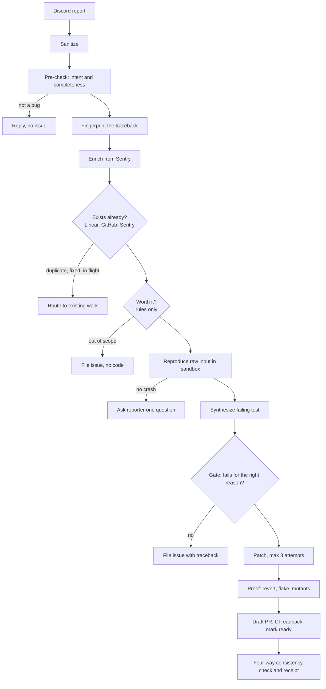

# ProofPR

**Coding agents open pull requests nobody can check. ProofPR cannot open a pull
request it has not proved.**

A bug report posted in Discord becomes one of two things: a pull request that
carries its own evidence, or an honest decline with a reason code. Never a
plausible diff with nothing behind it.

"If it can't prove the bug, it won't touch your code. If it can, the PR carries
the proof."

[](https://github.com/OWNER/proofpr/actions/workflows/ci.yml)
[](https://github.com/OWNER/proofpr/actions/workflows/security.yml)
[](LICENSE)

> Built for the Multi-App AI Agent Hackathon. Solo project.

> Status: milestones M0 through M7 built and tested end to end. A report is
> sanitized, classified, fingerprinted, enriched from Sentry, checked against
> Linear, GitHub and Sentry for work that already exists, and scored against the
> scope rules. Surviving reports are executed in a locked-down container to
> capture a real traceback and converted into a failing test that must pass the
> reproduction gate. A patch is then written and proved: the fix is reverted to
> check the test notices, the test is run three times for flakiness, and the
> patched lines are mutated to check the test actually examines the fix. Reports
> that do not reproduce get one precise question. A proved patch is published as
> a draft pull request whose body leads with the proof, and it leaves draft only
> when the checks API says CI passed. Everything is filed in Linear, attached to
> the pull request, and answered in the thread, with every write read back and
> all four applications checked against each other, and the run sealed with a
> hash-chained receipt that anyone can recompute with `proofpr verify-receipt`. A
> run killed at any point resumes from the last step that finished, without
> writing anything twice. After the run, three loops keep the record true:
> reporters are told when their fix merges, a fix that stops holding reopens
> itself, and a drift reconciler repairs disagreement between the four
> applications every six hours. M8 (evaluation datasets, splits, and the
> no-gate baseline arm) is built; the frozen test-split run that produces the
> numbers below is in progress. Commands that are not built yet say so and exit
> non-zero rather than pretending. See [AGENTS.md](AGENTS.md) section 16 for the
> full milestone plan.

Try it without any credentials:
>
> ```bash
> just install
> uv run proofpr run eval/datasets/seeded/001-month-out-of-range.yaml --dry-run
> ```
>
> The dry run uses in-memory applications and the real guard, ledger, and
> pipeline.

## What was built

ProofPR turns a bug report posted in Discord into a proof-carrying pull
request, or an honest decline, never a plausible diff with nothing behind it.

1. A user reports a bug in Discord.
2. ProofPR classifies intent, enriches the report from **Sentry**, then
   searches **Linear and GitHub** to see whether the issue already exists, was
   already fixed in a later release, or has a fix already in flight. Most
   reports end here, in seconds, having spent nothing.
3. Surviving reports are checked against rules: supported version, known fix
   class, patchable path. Out of scope still gets an issue; it just never gets
   code.
4. The report is reproduced inside a locked-down container. The real traceback
   is captured first, then converted into a single pytest test.
5. The test must fail on the base commit **for the right reason**. If it does
   not, no code is written. Ever.
6. Only then does the agent patch, and the patch must survive a revert check, a
   flake check, and mutation of its own changed lines.
7. The pull request carries the proof table. Linear and the Discord thread are
   updated and read back, all four applications are cross-checked, and a
   hash-chained receipt is recorded.

## External applications used

ProofPR writes to and reads back from four external applications, exceeding
the hackathon's three-app minimum:

| App | Role | What ProofPR does there |
|---|---|---|
| **Discord** | Intake and reporter loop | Reads the bug report, posts a live status message edited per step, asks the reporter clarifying questions, notifies them when the fix ships |
| **GitHub** | Code and CI | Creates a branch, opens a draft pull request with the proof block, polls the checks API, marks the PR ready only on green CI |
| **Linear** | Issue of record | Creates the issue, records the dedupe decision and decline reason, attaches the pull request and the receipt hash |
| **Sentry** | Enrichment and resolution | Enriches the report with the real event and stack trace, is resolved only after a merge, which is the one place the allowlist permits a status change at all |

Every write to every application is followed by a readback: a step only
succeeds when the observed state matches the intended state. All four are
cross-checked against each other at every terminal state (the "four-way
consistency" assertion), and a drift reconciler repeats that check every six
hours after the run ends.

## Setup

```bash
git clone https://github.com/OWNER/proofpr && cd proofpr
just install          # uv sync plus pre-commit hooks
cp .env.example .env  # fill in credentials, see docs/SETUP.md
just check            # lint, types, tests
just doctor           # one real write and readback per app, plus a sandbox run
```

Credentials and exact scopes for each of the four applications are in
[docs/SETUP.md](docs/SETUP.md). Every setting and environment variable is
documented in [docs/CONFIGURATION.md](docs/CONFIGURATION.md). No command
requires credentials to exercise the real pipeline: `proofpr run --dry-run`
and `proofpr doctor` both work with the packaged fixtures.

## Reliability testing

Nothing in this system is judged by the model that produced it. Verification
is layered:

- **The reproduction gate.** A generated test must fail on the base commit for
  the exception or assertion actually captured, not any failure. No test, no
  patch.
- **The proof checks.** Every proposed patch must survive a revert (the bug
  comes back), a flake check (three consecutive green runs), and mutation
  testing scoped to the diff (every mutant of the patched lines is killed).
- **Hidden maintainer tests.** For 20 real historical bugs across five real
  libraries, the upstream maintainer's own fix test, never shown to the model
  and never mounted into its sandbox, is applied after the run reaches a
  terminal state to decide correctness independently of ProofPR's own checks.
- **A paired baseline arm.** Every case runs twice on identical inputs: once as
  `no_gate`, a competent tool-calling agent with no proof requirements, and
  once through the full pipeline. The headline metric is the unsafe-PR rate
  avoided between the two arms, reported with Wilson intervals and N.
- **Crash and fault injection.** Every step has a crash test asserting the run
  reaches the same terminal state after a kill, including a real `SIGKILL` from
  a separate process. All four adapters are fault-injection tested against
  429s, 5xx, and timeouts.
- **Prompt-injection ablation.** Ten adversarial cases (fake tool calls,
  requests to add collaborators, exfiltration attempts) assert zero
  unauthorized writes, confirmed by readback.
- **Tamper-evident receipt.** Every run is sealed as a hash-chained receipt,
  independently recomputable with `proofpr verify-receipt`, printed in the pull
  request, the Linear issue, and the Discord thread.

The full methodology, dataset composition, and metric definitions are in
[docs/EVALUATION.md](docs/EVALUATION.md). Numbers from the frozen test split,
paired over identical case IDs for both arms, land in
[docs/RELIABILITY_BRIEF.md](docs/RELIABILITY_BRIEF.md) as soon as that run
completes; the brief states plainly what was measured and every case where the
baseline arm did better, rather than a headline with nothing behind it.

## Demo video

<!-- Add the ≤2 minute demo link here once recorded, per docs/DEMO.md. -->

## Architecture



## Documentation

| Document | What it answers |
|---|---|
| [AGENTS.md](AGENTS.md) | The full operating manual and the contract every contributor works to |
| [docs/ARCHITECTURE.md](docs/ARCHITECTURE.md) | Pipeline, durability, resume, ports and adapters |
| [docs/SETUP.md](docs/SETUP.md) | Credentials per app with exact scopes |
| [docs/CONFIGURATION.md](docs/CONFIGURATION.md) | Every key and environment variable |
| [docs/THREAT_MODEL.md](docs/THREAT_MODEL.md) | Trust boundaries, OWASP LLM mapping, residual risk |
| [docs/EVALUATION.md](docs/EVALUATION.md) | Datasets, splits, arms, metric definitions |
| [docs/RELIABILITY_BRIEF.md](docs/RELIABILITY_BRIEF.md) | The one-page submission brief with real numbers |
| [docs/RUNBOOK.md](docs/RUNBOOK.md) | Stuck runs, resume, reconcile, rotation |
| [docs/TARGET_REPO.md](docs/TARGET_REPO.md) | How the real historical bug repositories were selected |
| [docs/DEMO.md](docs/DEMO.md) | The demo script, minute by minute |
| [docs/adr/](docs/adr/) | Why each decision was made, and what was rejected |

## Design commitments

- **The model has no tools.** A deterministic state machine performs every
  write. The model returns validated JSON and nothing else.
- **Every write is read back.** A step succeeds only when the application
  agrees.
- **Tests and CI are the judge.** There is no LLM-as-judge anywhere in the
  evaluation.
- **Asymmetric defaults.** Uncertainty before the code-writing stages resolves
  toward filing an issue for a human. Uncertainty after the gate resolves
  toward stopping. The agent may over-file; it may never over-code.

## License

Apache-2.0. See [LICENSE](LICENSE).
